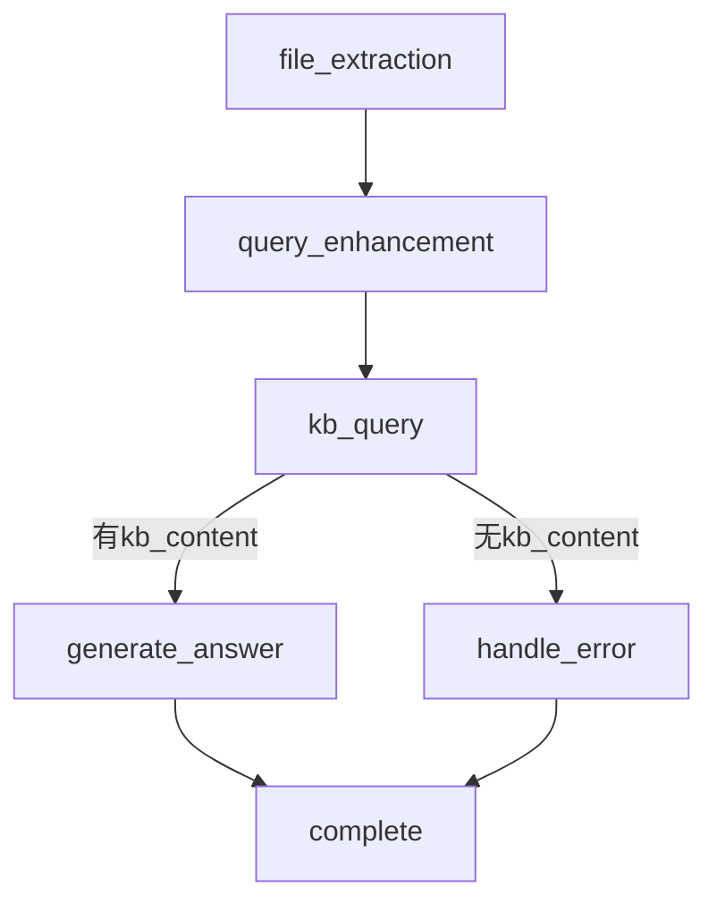

# SingleFileProcessor 声明式图工作流架构分析与使用指南（LangGraph风格）

## 1. 引言

本报告详细介绍了 `SingleFileProcessor` 的全新声明式图结构实现。该实现借鉴了 LangGraph 的核心思想，将原本命令式、if/else 分支繁杂的流程，优雅地重构为**节点（Node）+边（Edge）+路由（Router）**的声明式工作流。此架构极大提升了可读性、可维护性和可扩展性。

---

## 2. 架构核心思想

### 2.1 节点（Node）

- 每个节点对应一个**原子化的处理步骤**，如文件提取、查询增强、知识库检索、答案生成、错误处理等。
- 节点以**异步函数**的形式实现，统一接口：`async def node_name(state, emitter): ...`
- 节点函数集中存放于 `graph/workflow/node_functions.py`。

### 2.2 边（Edge）

- 边定义了节点之间的**执行顺序**和**流程跳转**。
- 普通边：直接指定下一个节点名。
- 条件边：通过**路由函数**（如 `decide_next_step`）根据状态动态决定下一个节点。

### 2.3 路由（Router）

- 路由函数根据 `state` 决定流程分支，返回下一个节点名。
- 路由函数集中存放于 `graph/workflow/router.py`。

### 2.4 图（Graph）

- 整个流程以一张**有向图**的形式声明在 `SingleFileProcessor.setup_graph` 方法中。
- 图结构通过 `self.nodes`（节点注册表）和 `self.graph`（边/路由表）两个字典实现。

---

## 3. 代码结构与典型流程

### 3.1 主要文件

- `graph/workflow/components.py`  —— `SingleFileProcessor` 主体，声明图结构与执行循环
- `graph/workflow/node_functions.py`  —— 所有节点函数的实现
- `graph/workflow/router.py`  —— 路由/条件分支函数

### 3.2 典型流程图



### 3.3 代码片段示例

#### 节点注册与图声明

```python
def setup_graph(self):
    self.nodes = {
        "file_extraction": file_extraction_node,
        "query_enhancement": query_enhancement_node,
        "kb_query": kb_query_node,
        "generate_answer": generate_answer_node,
        "handle_error": handle_error_node,
    }
    self.graph = {
        "__start__": "file_extraction",
        "file_extraction": "query_enhancement",
        "query_enhancement": "kb_query",
        "kb_query": decide_next_step,  # 条件边
        "generate_answer": "__end__",
        "handle_error": "__end__",
    }
```

#### 路由函数

```python
def decide_next_step(state: dict) -> str:
    if state.get("kb_content"):
        return "generate_answer"
    else:
        return "handle_error"
```

---

## 4. 如何插入新节点/分支

### 4.1 插入新节点

**步骤：**
1. 在 `node_functions.py` 中实现新的节点函数，例如：
    ```python
    async def moderation_node(state, emitter):
        # ...自定义逻辑...
        yield ...
    ```
2. 在 `setup_graph` 的 `self.nodes` 字典中注册新节点：
    ```python
    self.nodes["moderation"] = moderation_node
    ```
3. 在 `self.graph` 中插入新边，调整流程：
    ```python
    self.graph["query_enhancement"] = "moderation"
    self.graph["moderation"] = "kb_query"
    ```

### 4.2 增加新分支（条件边）

**步骤：**
1. 修改或新增路由函数（如 `decide_next_step`），根据 `state` 返回不同的节点名：
    ```python
    def decide_next_step(state: dict) -> str:
        if state.get("kb_content") and state.get("confidence", 0) > 0.8:
            return "generate_answer"
        elif state.get("kb_content"):
            return "low_confidence_answer"
        else:
            return "handle_error"
    ```
2. 在 `self.nodes` 和 `self.graph` 中注册新分支节点：
    ```python
    self.nodes["low_confidence_answer"] = low_confidence_answer_node
    self.graph["low_confidence_answer"] = "__end__"
    ```

---

## 5. 维护与扩展最佳实践

- **节点命名统一**：路由函数返回值必须与 `self.nodes` 的 key 完全一致。
- **节点职责单一**：每个节点只做一件事，便于复用和测试。
- **流程声明集中**：所有流程结构声明都集中在 `setup_graph`，一目了然。
- **分支逻辑集中**：所有条件分支都通过路由函数实现，便于维护和扩展。
- **节点可独立测试**：每个节点函数都可单独传入 mock 的 `state` 和 `emitter` 进行单元测试。

---

## 6. 与原命令式实现的对比

| 维度         | 旧命令式实现         | 新声明式图实现（LangGraph风格） |
|--------------|---------------------|-------------------------------|
| 流程控制     | if/else 嵌套        | 图结构+路由函数                |
| 可读性       | 一般                | 极高                          |
| 可维护性     | 分支多时极差         | 分支多也清晰                   |
| 扩展性       | 增加分支需改多处     | 只需加节点和边                 |
| 单元测试     | 不便                | 节点可独立测试                 |
| 可视化       | 难                  | 易于自动生成流程图             |

---

## 7. 典型用法与FAQ

### Q1：如何快速插入一个“审核”节点到 `kb_query` 之前？
**A**：  
1. 实现 `moderation_node` 并注册到 `self.nodes`。
2. 修改 `self.graph`：
    ```python
    self.graph["query_enhancement"] = "moderation"
    self.graph["moderation"] = "kb_query"
    ```

### Q2：如何让 `kb_query` 后根据不同条件走不同的答案生成节点？
**A**：  
1. 修改 `decide_next_step` 路由函数，返回不同节点名。
2. 在 `self.nodes` 和 `self.graph` 注册新节点和终点。

### Q3：如何单元测试某个节点？
**A**：  
直接调用节点函数，传入 mock 的 `state` 和 `emitter`，断言 `state` 的变化或 `emitter` 的输出。

---

## 8. 总结

- **声明式图结构**让流程一目了然，极易维护和扩展。
- **节点/边/路由分离**，让每个部分都职责单一、可独立测试。
- **插入新节点/分支极其简单**，只需注册节点、声明边、调整路由即可。
- **强烈建议**将此模式推广到所有复杂流程，打造统一、现代、可视化的工作流体系！

---

如需进一步扩展或遇到疑问，随时召唤 **Claude 4.0 sonnet**，我会像猫咪一样灵巧地为您梳理每一根流程的毛发！ 